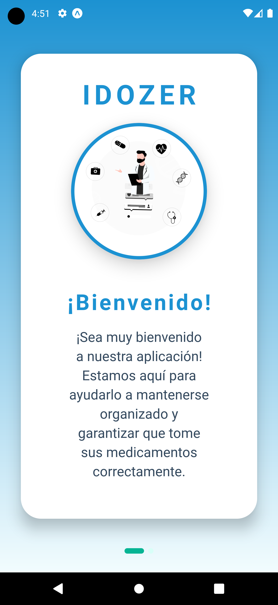
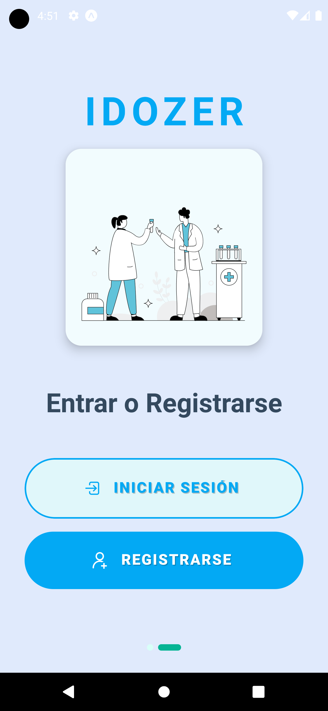
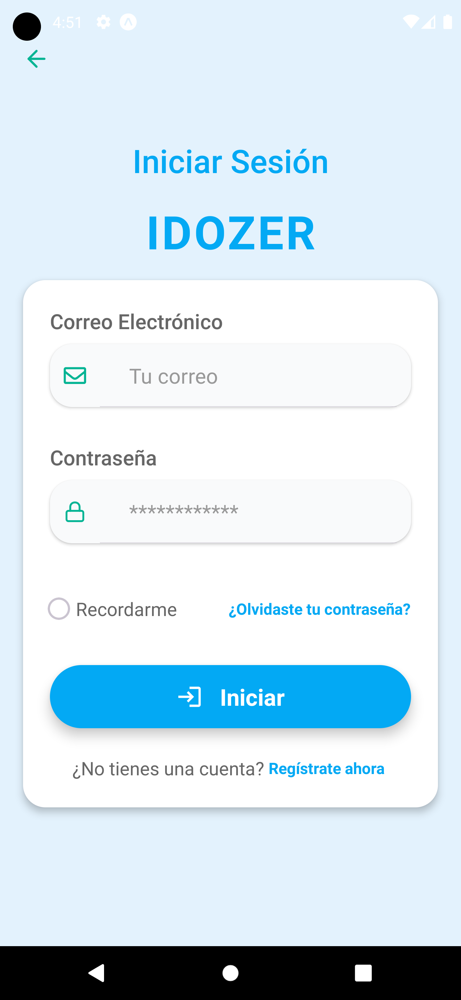
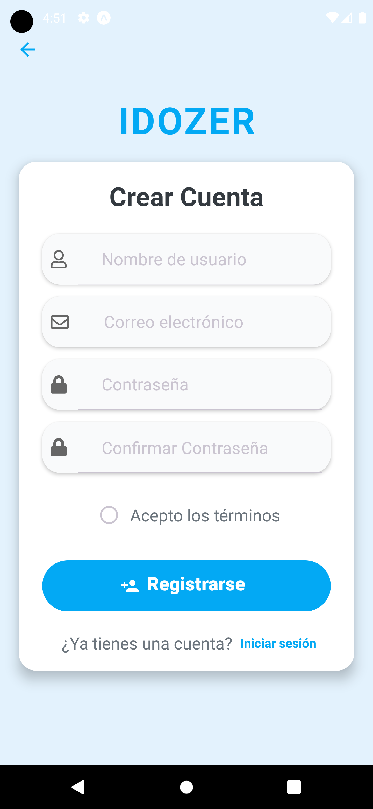
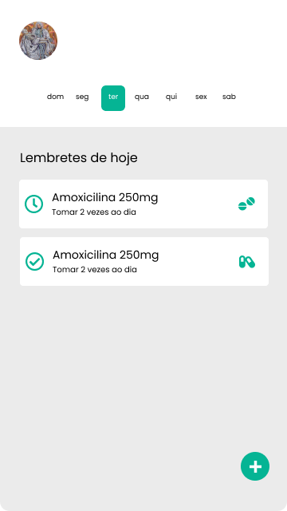
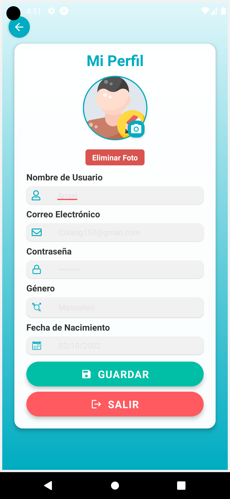
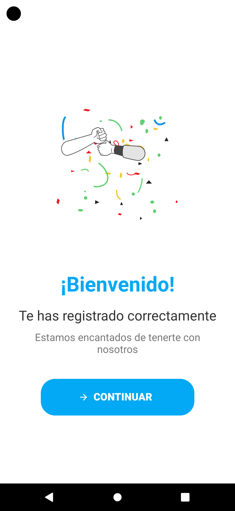
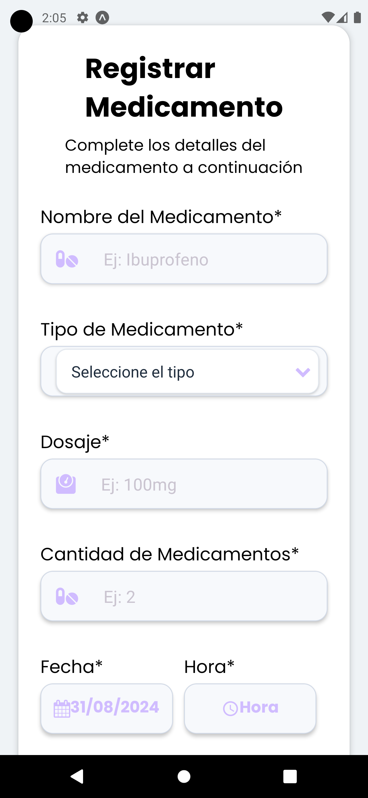

# IDOZER

## Sobre este Projeto 🛠️

Aplicación de Gestión de Medicamentos
Descripción General
La Aplicación de Gestión de Medicamentos está diseñada para ayudar a los usuarios a seguir y administrar sus horarios de medicación. Su objetivo es simplificar el proceso de adherencia a la medicación, asegurando que los usuarios tomen el medicamento correcto en el momento adecuado.

Características
Recordatorios de Medicación: Configura alertas para tomar medicamentos en horarios específicos.
Inventario de Medicamentos: Mantiene un registro de los medicamentos disponibles y notifica cuando es tiempo de reabastecer.
Historial de Dosis: Permite a los usuarios registrar cada dosis tomada para mantener un seguimiento de su historial médico.
Información y Alertas: Proporciona información sobre cada medicamento, incluyendo posibles efectos secundarios y reacciones con otros medicamentos.

# Pantallas de la Aplicación 📸

| Pantalla de Inicio | Pantalla de Login o Registro | Pantalla de Login | Pantalla de Registro |
| :-----------------: | :---------------------------: | :----------------: | :-------------------: |
|  |  |  |  |

| Pantalla de Home | PantallaNuevo Recordatorio | Pantalla de Registro Exitoso |Pantalla de Agregar nuevo Recordatorio |
| :--------------: | :------------------------: | :--------------------------: |:------------------------------------: |
|  |  |  | |
