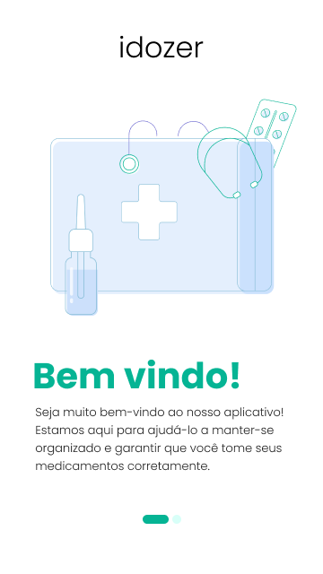
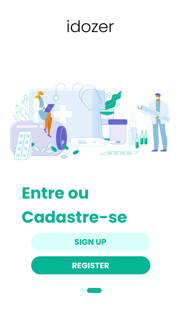
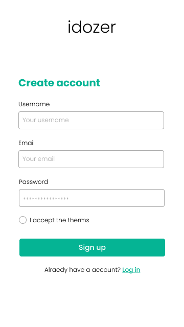
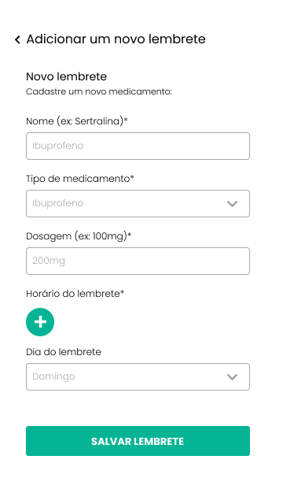

# IDOZER

## Sobre o Projeto 🛠️

Este projeto foi desenvolvido como avaliação final da disciplina de Desenvolvimento de Sistemas Móveis (DDMI6) e tem como objetivo principal oferecer uma solução prática e intuitiva para auxiliar pessoas idosas na gestão de sua saúde através de um aplicativo de lembrete de medicamentos. Desenvolvido em React Native.

## Overview / Screenshots 📸

|                         Start Screen                         |                         Login Or Register                          |                       Login Screen                       |                      Register Screen                      |
| :----------------------------------------------------------: | :----------------------------------------------------------------: | :------------------------------------------------------: | :-------------------------------------------------------: |
|  |  |  |  |

|                       Home Screen                       |                        Add New Reminder                        |
| :-----------------------------------------------------: | :------------------------------------------------------------: |
|  |  |
